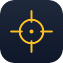

<p align="center">
  
</p>

<h1 align="center">Beacon</h1>

<p align="center">
  A macOS menu bar app that helps you find and track your mouse cursor.<br>
  Crosshair overlay · Spotlight mode · Ping to center<br><br>
  <a href="https://github.com/foundinblank/beacon-app/releases">Download</a> · Requires macOS 14+
</p>

---

Beacon adds a customizable crosshair overlay, spotlight mode, and ping animation so you never lose sight of your cursor. Designed for visually impaired users, anyone with a large or multi-monitor setup, and presenters who want their audience to follow along.

Runs entirely in the menu bar — no dock icon, no windows to manage. The overlay is click-through, so it never interferes with your workflow.

## Features

- **Crosshair Overlay** — Horizontal and vertical lines that follow your cursor. Customize color, thickness, and line style (solid, dashed, or dotted).
- **Spotlight Mode** — A circular highlight around the cursor with adjustable radius and background dimming, making it easy to spot on busy screens.
- **Ping** — Press **Cmd+0** to instantly center your cursor on screen with a ripple animation. Three modes: center + ripple, center only, or ripple only.
- **Fade After Idle** — The overlay fades out when the mouse is still and reappears when you move it.
- **Multi-Monitor Support** — Automatically detects all connected displays and follows the cursor across screens.
- **Master Color Sync** — Set one color and apply it across all features at once.
- **Launch at Login** — Start Beacon automatically when you log in.
- **Accessibility** — VoiceOver announcements and Reduce Motion support.

## Installation

### Download

Download the latest `Beacon.dmg` from [GitHub Releases](https://github.com/foundinblank/beacon-app/releases). Open the DMG and drag Beacon to your Applications folder.

The app is signed and notarized by Apple — no quarantine workarounds needed.

### Build from Source

Requires Xcode and macOS 14+. No external dependencies.

```bash
git clone https://github.com/foundinblank/beacon-app.git
cd beacon-app
xcodebuild -project Beacon/Beacon.xcodeproj -scheme Beacon build
```

Or open `Beacon/Beacon.xcodeproj` in Xcode and press Cmd+R.

## Usage

Beacon lives in your menu bar with a crosshair icon. Click it to toggle features, trigger a ping, or open settings.

| Action | How |
|--------|-----|
| Toggle crosshair | Menu bar > Crosshair |
| Toggle spotlight | Menu bar > Spotlight |
| Ping (center cursor + ripple) | **Cmd+0** |
| Open settings | Menu bar > Settings (or **Cmd+,**) |
| Quit | Menu bar > Quit (or **Cmd+Q**) |

## Privacy

Beacon does not collect any data. All preferences are stored locally. See [Privacy Policy](PRIVACY.md).

## License

Copyright (c) 2026 Adam Stone. All rights reserved.
